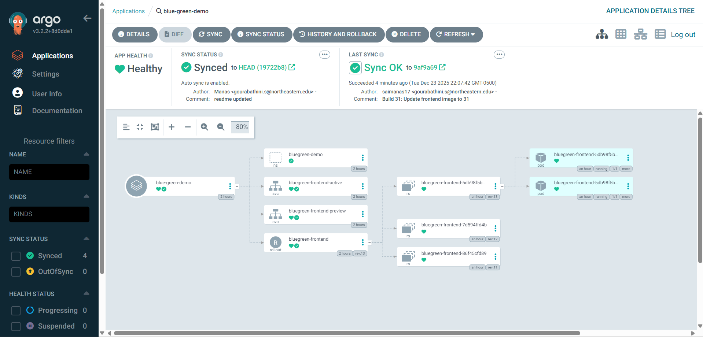

# Kubernetes Manifests for Blue-Green Deployment

GitOps repository with Kubernetes manifests for blue-green deployment using Argo Rollouts.

## 📂 Structure

```
argo-bluegreen-manifests/
├── rollout.yaml                # Argo Rollouts config
├── service-active.yaml         # Production (port 30080)
├── service-preview.yaml        # Preview (port 30081)
├── namespace.yaml              # Kubernetes namespace
└── README.md
```

## 🔑 Key Configuration

**rollout.yaml**:

- `replicas: 2` - High availability
- `autoPromotionEnabled: false` - Manual approval required
- `scaleDownDelaySeconds: 30` - Wait before scaling down old version
- `activeService` - Production traffic (30080)
- `previewService` - Preview traffic (30081)

**Sync Policy**:

- Automated sync enabled
- Auto-prune deleted resources
- Self-heal if cluster drifts from Git

## 🔄 Deployment Flow

```
Jenkins updates image tag in rollout.yaml
              ↓
Commits and pushes to this repo
              ↓
GitHub webhook triggers ArgoCD
              ↓
ArgoCD syncs to Kubernetes
              ↓
Argo Rollouts creates preview
   - New pods (preview service)
   - Old pods (active service)
              ↓
Manual testing on preview
              ↓
Promotion → Active service switches to new pods
              ↓
Old pods scaled down after 30s
```

## 🚀 Setup

### Install Argo Rollouts

```bash
# Create namespace
kubectl create namespace argo-rollouts

# Install Argo Rollouts controller
kubectl apply -n argo-rollouts -f https://github.com/argoproj/argo-rollouts/releases/latest/download/install.yaml

# Install kubectl plugin
curl -LO https://github.com/argoproj/argo-rollouts/releases/latest/download/kubectl-argo-rollouts-linux-amd64
chmod +x kubectl-argo-rollouts-linux-amd64
sudo mv kubectl-argo-rollouts-linux-amd64 /usr/local/bin/kubectl-argo-rollouts
```

### Apply Manifests

```bash
# Apply all manifests
kubectl apply -f namespace.yaml
kubectl apply -f rollout.yaml
kubectl apply -f service-active.yaml
kubectl apply -f service-preview.yaml
```

### Create ArgoCD Application (Manual Setup)

This project uses **manual ArgoCD Application creation via UI** instead of declarative YAML.

**Steps:**

1. Access ArgoCD UI
2. Click **"+ NEW APP"**
3. Configure:
   - **Application Name**: `blue-green-demo`
   - **Project**: `default`
   - **Sync Policy**: `Automatic`
   - **Repository URL**: `https://github.com/saimanas17/argo-bluegreen-manifests`
   - **Revision**: `HEAD` or `main`
   - **Path**: `.`
   - **Cluster URL**: `https://kubernetes.default.svc`
   - **Namespace**: `bluegreen-demo`
4. Enable:
   - ☑️ **Auto-Create Namespace**
   - ☑️ **Auto-Sync**
   - ☑️ **Prune Resources**
   - ☑️ **Self Heal**
5. Click **"CREATE"**

**Result:**



The application syncs automatically and shows:

- Namespace
- Services (active, preview)
- Rollout
- ReplicaSets
- Pods

### Configure GitHub Webhook

Settings → Webhooks → Add webhook:

```
Payload URL: https://<ARGOCD_SERVER>/api/webhook
Content type: application/json
Events: Just the push event
Active: ✓
```

## 🎮 Management Commands

```bash
# View rollout status
kubectl argo rollouts get rollout bluegreen-frontend -n bluegreen-demo

# Watch live
kubectl argo rollouts get rollout bluegreen-frontend -n bluegreen-demo --watch

# Promote to switch traffic
kubectl argo rollouts promote bluegreen-frontend -n bluegreen-demo

# Rollback
kubectl argo rollouts undo bluegreen-frontend -n bluegreen-demo

# Rollback to specific revision
kubectl argo rollouts undo bluegreen-frontend -n bluegreen-demo --to-revision=2

# View history
kubectl argo rollouts history bluegreen-frontend -n bluegreen-demo

# Abort rollout
kubectl argo rollouts abort bluegreen-frontend -n bluegreen-demo

# Restart
kubectl argo rollouts restart bluegreen-frontend -n bluegreen-demo
```

## 📊 Monitoring

### ArgoCD Dashboard

```bash
# Access ArgoCD UI (already exposed)
# Navigate to: https://<ARGOCD_SERVER>

# Get admin password
kubectl -n argocd get secret argocd-initial-admin-secret -o jsonpath="{.data.password}" | base64 -d
```

### Argo Rollouts Dashboard

### Check Resources

```bash
# Check services
kubectl get svc -n bluegreen-demo

# Check pods
kubectl get pods -n bluegreen-demo

# Check rollout
kubectl get rollout -n bluegreen-demo

# Pod logs
kubectl logs -n bluegreen-demo -l app=bluegreen-frontend --tail=50
```

## 🔗 Related

- [Application Repository](https://github.com/saimanas17/argocd-bluegreen-app)
- [Parent Repository](https://github.com/saimanas17/argocd-bluegreen)
- [Argo Rollouts Docs](https://argoproj.github.io/argo-rollouts/)
- [ArgoCD Docs](https://argo-cd.readthedocs.io/)

## 📞 Contact

Email: gourabathini.s@northeastern.edu  
GitHub: [@saimanas17](https://github.com/saimanas17)

---

**Part of ArgoCD Blue-Green Deployment Demo**
